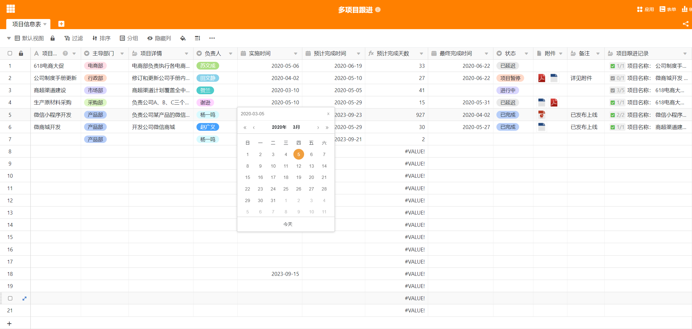

# project-table

> A frontend table componet used for managing project. An imitation of [SeaTable](https://seatable.cn/)

## TODOS

- [ ] date picker
- [ ] number input
- [ ] inline input
- [ ] selector input
- [ ] progress bar
- [ ] person picker
- [ ] tag
- [ ] badge
- [ ] resizable
- [ ] sortable
- [ ] checkbox column
- [ ] radio column
- [ ] tree

## Reference Links

- [Vue easytable](https://happy-coding-clans.github.io/vue-easytable/#/en/demo)
- [ElementUI](https://github.com/ElemeFE/element)
